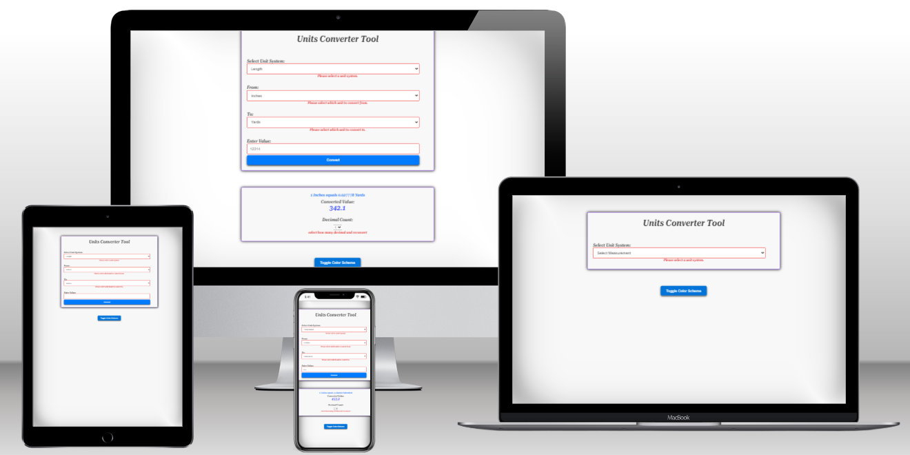
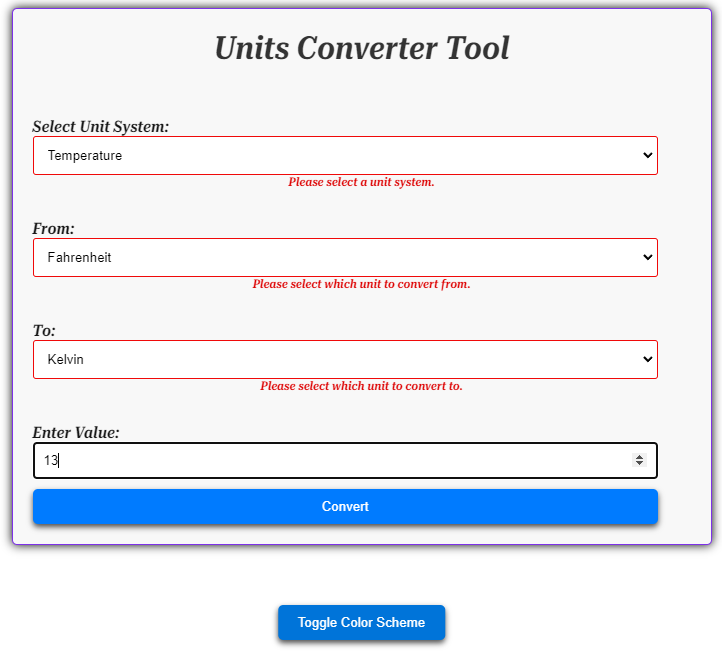
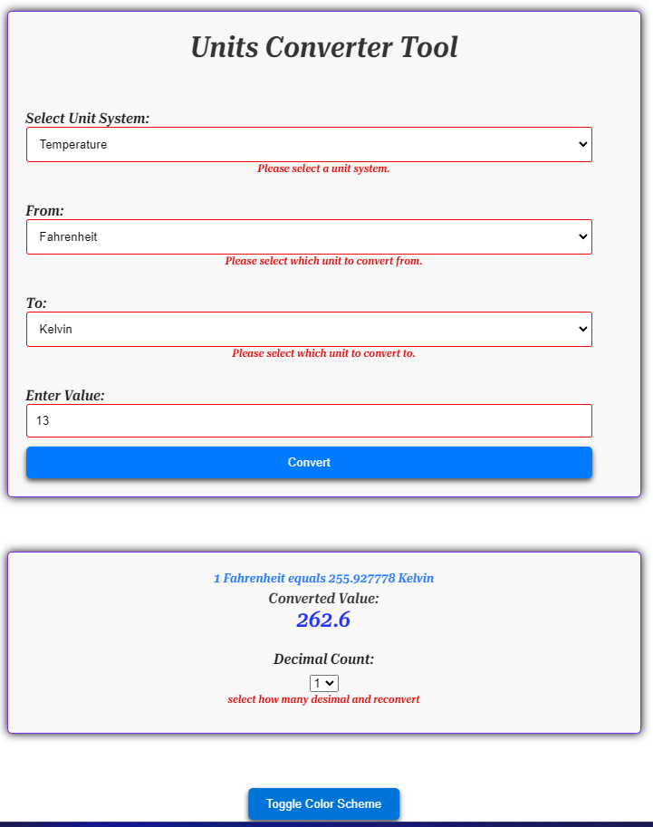
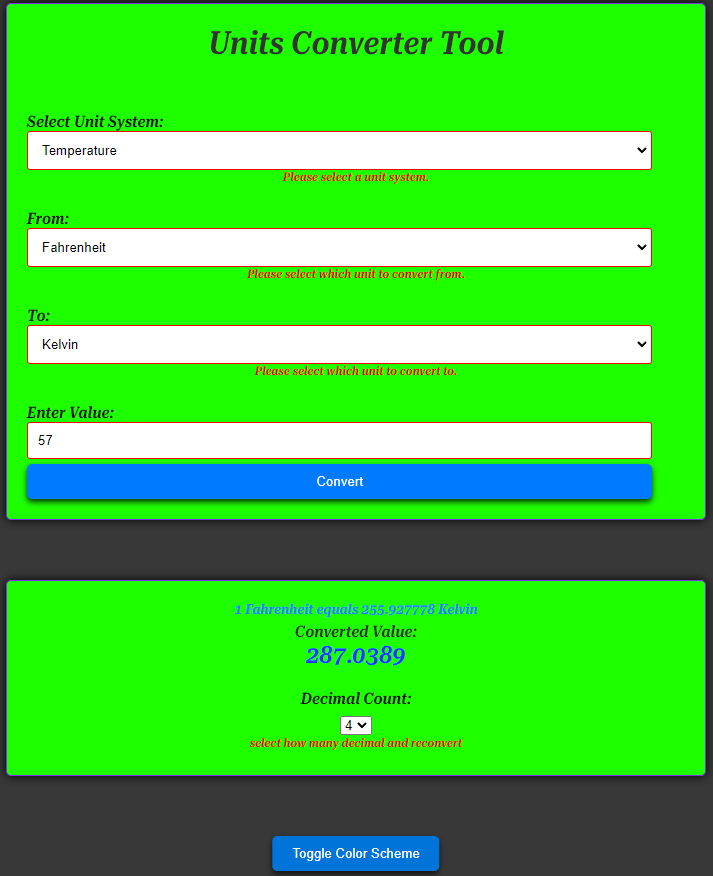

# Welcome to my online Units Converter Tool!

You can find the live website [here](https://mufasa1611.github.io/Project2-Converter/)

## Index - Table of Contents

- [Design](#design)
   - [Wireframes](#wireframes)
   - [Font and Colours](#font-and-colours)

- [Features](#features)
    - [Existing Features](#existing-features)
    - [Future Features](#possible-future-features)

- [UX](#ux)
    - [Site Goals](#site-goals)
    - [User Stories](#user-stories)

- [Testing](#testing)
    - [Validator Testing](#validator-testing)
    - [Browser Testing](#browser-testing)
    - [Manual Testing](#manual-testing)
    - [Testing User Stories](#testing-user-stories)
    - [Fixed Bugs](#fixed-bugs)
    - [Unfixed Bugs](#unfixed-bugs)

- [Deployment](#deployment)

- [Credits](#credits)
    - [Media](#media)
    - [Code](#code)
    - [Content](#content)

## Design

### Wireframes

for Desktop and Mobile:
 

### Fonts and Colours
- I chose the free 'RobotoSerif_UltraC' and 'RobotoSerif_Thin' for the whole page to stay consistent for better user accessibility. The fonts were downloaded from google fonts and are placed in the local folder "fonts".

- The colors were chosen considering good contrasts for better readabiliy

## Features

### Existing Features

- When entering the site, the user can see a box with the title "Units Converter Tool" with a drop down box from which he is asked to select a unit system. 

- After selecting the unit system, the box expands to show drop-down boxes to select a he unit to convert from and a unit to convert to, as well as an input field to enter a decimal value. Below this field is a convert button, to start the conversion process.

- Next a second box appears below showing the conversion result for one unit and the converted value with one decimal place. An invalid entry in the "enter value" field will display a pop-up message asking the user to input a valid decimal number. 

- Also a drop-down box is placed beneath with instructions asking the user to select the desired decimal places for the result from 1 to 9 and to press the convert button again. The converted value is then shown updated as per the user preference.

- All the time, the user has the choice to click on a button called "Toggle Color Scheme" to toggle between a default light color scheme:

 

and a dark color scheme:

.

### Future Features
 - possible future features inlcude online conversion for other units such as for volume, area and weight.

## UX
   
### Site Goals
- the idea is to provide an easy to use, useful, fun online conversion tool for common units, giving the user the choice to select the units, the desired decimal places for the result and to toggle between two color schemes

### User Stories
- the site and the tool should be easy to navigate and to use, the instructions easy to understand and to follow, the site fun and interesting to interact with

## Technologies used
- [Balsamiq](https://balsamiq.com/) was used to pre-design the layout
- [GitHub](https://github.com/) was used to host the deployed website
- Screenshots were taken with [FireShot](https://chrome.google.com/webstore/detail/take-webpage-screenshots/mcbpblocgmgfnpjjppndjkmgjaogfceg)
- [Gitpod](https://www.gitpod.io/) was used as environment to write and develop the code 

## Languages used
- [HTML5](https://en.wikipedia.org/wiki/HTML5)
- [CSS3](https://en.wikipedia.org/wiki/Cascading_Style_Sheets)
- [Javascript](https://en.wikipedia.org/wiki/JavaScript)

## Testing

### Validator Testing

- CSS Testing on [W3C Validation Service](https://jigsaw.w3.org/css-validator/) found no error

- HTML Testing on [W3C Validation Service](https://jigsaw.w3.org/css-validator/) showed no errors or warning

- when running the JS File on [JSHint](https://jshint.com/) no major issues were found

### Browser Testing

### Testing

- Lighthouse Test for Desktop:

- Lighthouse Test for Mobile:

### Fixed Bugs

### Unfixed Bugs

## Deployment
The steps to deploy a website on GitHub pages are:

- Open the repository and go to the Settings tab
- Navigate to the Pages tab in the left menu
- Choose Deploy from a branch and select your branch, which is main in most cases
- Click save 
- The link to the deployed website can then be found in the repository on the right menu under Environments

- The link to my live site is here: [Units Converter](https://mufasa1611.github.io/Project2-Converter)

### Local Depoloyment

## Credits

### Media

### Code

### Content

## Acknowledgements

Big Thanks to:

- My Mentor [Jack Wachira](https://code-institute-room.slack.com/team/U01GBLV8S9L) for his help and advice through this project

- My facilitator [Kay Ci](https://code-institute-room.slack.com/team/U056NU8DZEW) for her support and for providing detailed links to the information I needed.

